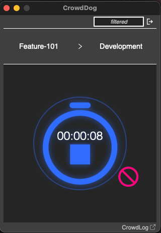

# Crowdlog Stopwatch Desktop App

This is a desktop app for the [Crowdlog](https://crowdlog.io/) stopwatch feature, built with [Tauri](https://tauri.app/) and [SvelteKit](https://svelte.dev).
The original feature in their web app is not very user-friendly, so this app aims to provide a better experience.

_※This app is for personal use, and is not affiliated with Crowdlog in any way nor endorsed by them._

# Features

- Select a project and a process just like you do in their web app.
- Start/stop/cancel the stopwatch.
- Automatically login with your Crowdlog credentials when the app is started, and when the session ends on their side.

# How to Use

The app is not published and is not planned to be published.
If you want to use it, you can pull this repo and build it yourself.

The app stores your crowdlog credentials in a local file, so you can use it without logging in every time.
The credentials are somewhat encrypted, but you should not use this app if you are an admin user and concerned about security.

## How to Build

- [Setup a Tauri v1 environment](https://v1.tauri.app/v1/guides/getting-started/prerequisites).
- Run `pnpm install` in the root directory of this repo to install dependencies.
- (You can try the app by running `pnpm dev`).
- Run `pnpm build` to build the app. (Consult the [Tauri documentation](https://v1.tauri.app/v1/guides/building/) for more details on building).

# Possible Improvements (Not Planned)

- Implement a system tray icon to start/stop the stopwatch without opening the app.
- Implement a way to select a project and a process from the system tray icon.
- Add a setting to set the rounding mode of the stopwatch.
